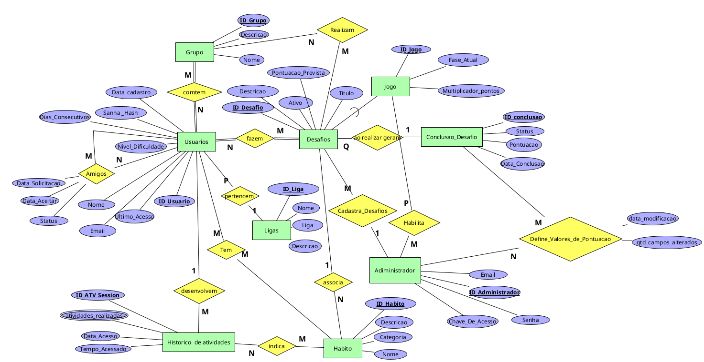

# Nome preliminar do aplicativo: Healthy Challenge Web

O Healthy Challenge Web é uma aplicação web gamificada voltada para incentivar hábitos saudáveis por meio de competição social. A proposta do sistema é transformar atividades do dia a dia — como beber água, caminhar ou realizar exercícios mentais — em desafios que geram pontuação, promovendo engajamento contínuo dos usuários.

A plataforma combina elementos de gamificação, interação social e competição, permitindo que os usuários acompanhem seu desempenho individual e o comparem com amigos ou com a comunidade global.


# Especificacao um pouco maior/ descricao

O sistema contará com funcionalidades essenciais como cadastro e login de usuários, além de um sistema de rankings dividido entre global e local, sendo este último baseado em grupos de amigos adicionados pelo próprio usuário. A lógica central gira em torno da gamificação: ao completar tarefas, o usuário acumula pontos e pode evoluir entre ligas, desbloqueando desafios mais difíceis e aumentando o nível de competitividade.

Além dos desafios voltados a hábitos saudáveis mais simples, a aplicação também incluirá atividades interativas, como mini-jogos cognitivos. Um exemplo é um jogo de memória baseado em uma matriz de cores, no qual o usuário precisa memorizar e reproduzir padrões dentro de um tempo limite. O sistema será desenvolvido para web, utilizando uma arquitetura cliente-servidor, permitindo uma experiência dinâmica no navegador e suporte à evolução futura do projeto.

# Problema que o sistema pretende solucionar e sua relação com os ODS

Atualmente, muitas pessoas enfrentam dificuldades para manter hábitos saudáveis de forma consistente devido à falta de motivação, acompanhamento contínuo e incentivo social. Além disso, atividades relacionadas ao bem-estar físico e mental frequentemente acabam sendo deixadas de lado na rotina diária, reduzindo a qualidade de vida e o engajamento com práticas saudáveis.

O Healthy Challenge Web busca solucionar esse problema por meio da gamificação e da interação social, transformando hábitos cotidianos em desafios interativos que geram pontuação, evolução em ligas e participação em rankings. Dessa forma, o sistema pretende aumentar o engajamento dos usuários e incentivar a adoção de práticas saudáveis de maneira mais dinâmica, competitiva e divertida.

O projeto também se relaciona diretamente com o Objetivo de Desenvolvimento Sustentável (ODS) 3 — Saúde e Bem-Estar, proposto pela ONU, ao promover ações voltadas à melhoria da saúde física e mental, incentivando hábitos positivos e maior qualidade de vida entre os usuários.

# Público Alvo

O público-alvo do Healthy Challenge Web é composto principalmente por estudantes universitários e adultos que desejam desenvolver e manter hábitos saudáveis de forma mais motivadora e interativa. A plataforma busca atender pessoas que possuem rotinas corridas e dificuldade em manter constância em práticas de bem-estar físico e mental, utilizando elementos de gamificação, competição social e desafios para aumentar o engajamento e incentivar uma rotina mais saudável.


# Banco de dados 

Banco de Dados

PostgreSQL (principal)




# Integrantes


Arthur Norberto da Silveira

Kevin Caley Lauar Ferreira Quimatzoyaro

Lucas de Oliveira Barboza

Lucas Terra Vieira de Oliveira

Taylanne Patricia Mendes

Thais Ferreira de Oliveira Almeida
# Kanbam Projeto
https://github.com/users/AlunoKevin/projects/5/views/1

# Tecnologias previstas 

Front-end: React / HTML / CSS / JavaScript


Back-end: Node.js / Express


Banco de dados: PostgreSQL


Controle de versão: Git/GitHub


# Como executar o programa

O projeto é dividido em **frontend** (React + Vite, na raiz) e **backend** (Node.js + Express, na pasta `backend/`). É preciso ter instalados: **Node.js** e **PostgreSQL**.

## 1. Configurar o banco de dados (apenas na primeira vez)

```bash
createdb healthy_challenge          # ou: psql -c "CREATE DATABASE healthy_challenge;"
```

Na pasta `backend/`, copie o arquivo de variáveis de ambiente e preencha com suas credenciais do PostgreSQL:

```bash
cp backend/.env.example backend/.env
# edite backend/.env: DB_USER, DB_PASSWORD, DB_NAME, JWT_SECRET, etc.
```

Aplique o schema e insira os dados de teste:

```bash
node backend/scripts/aplicar_schema.js
node backend/scripts/inserir_dados_test.js
```

## 2. Instalar dependências

```bash
npm install                         # dependências do frontend (raiz)
npm install --prefix backend        # dependências do backend
```

## 3. Rodar o projeto completo

```bash
npm start                           # sobe backend em http://localhost:3001 e frontend em http://localhost:5173
```

> **Caso a porta 3001 já esteja em uso:** execute `fuser -k 3001/tcp` antes de rodar `npm start`.

Para rodar os testes automatizados do backend (Jest):

```bash
npm test --prefix backend
```

### Rotas da API disponíveis

| Método | Rota | Descrição |
|---|---|---|
| GET | `/health` | Verifica se a API está no ar |
| POST | `/auth/cadastro` | Cadastra um usuário (`nome`, `email`, `senha`, `nivel_dificuldade` opcional) |
| POST | `/auth/login` | Faz login e retorna um token JWT |
| GET | `/auth/perfil` | Dados do usuário logado (requer `Authorization: Bearer <token>`) |
| GET | `/leaderboard/global` | Ranking global |
| GET | `/leaderboard/grupo/:idGrupo` | Ranking de um grupo |
| GET | `/desafios` | Lista todos os desafios ativos |
| GET | `/desafios/meus` | Desafios em que o usuário está inscrito (requer token) |
| GET | `/desafios/concluidos` | Desafios concluídos pelo usuário (requer token) |
| POST | `/desafios/:id/inscrever` | Inscreve o usuário em um desafio (requer token) |
| POST | `/desafios/:id/concluir` | Conclui um desafio (requer token) |
| POST | `/desafios` | Cria desafio — somente admin |
| PUT | `/desafios/:id` | Atualiza desafio — somente admin |
| DELETE | `/desafios/:id` | Inativa desafio — somente admin |
| GET | `/ligas` | Lista todas as ligas |
| GET | `/ligas/minha` | Liga atual do usuário logado (requer token) |
| POST | `/admin/login` | Login de administrador |
| GET | `/admin/status` | Verifica autenticação de admin (requer token admin) |
| POST | `/grupos` | Cria um grupo (requer token) |
| POST | `/grupos/:id/membros` | Adiciona membro ao grupo (requer token) |
| DELETE | `/grupos/:id/membros/:userId` | Remove membro do grupo (requer token) |
| GET | `/usuario/ranking-info` | Dados de ranking do usuário logado (requer token) |

Exemplos de teste via curl:

```bash
curl http://localhost:3001/leaderboard/global
curl http://localhost:3001/desafios
curl http://localhost:3001/ligas
```

## Rodar frontend e backend separadamente (opcional)

```bash
# backend
npm run dev:back                    # sobe em http://localhost:3001

# frontend (outro terminal)
npm run dev:front                   # sobe em http://localhost:5173
```

