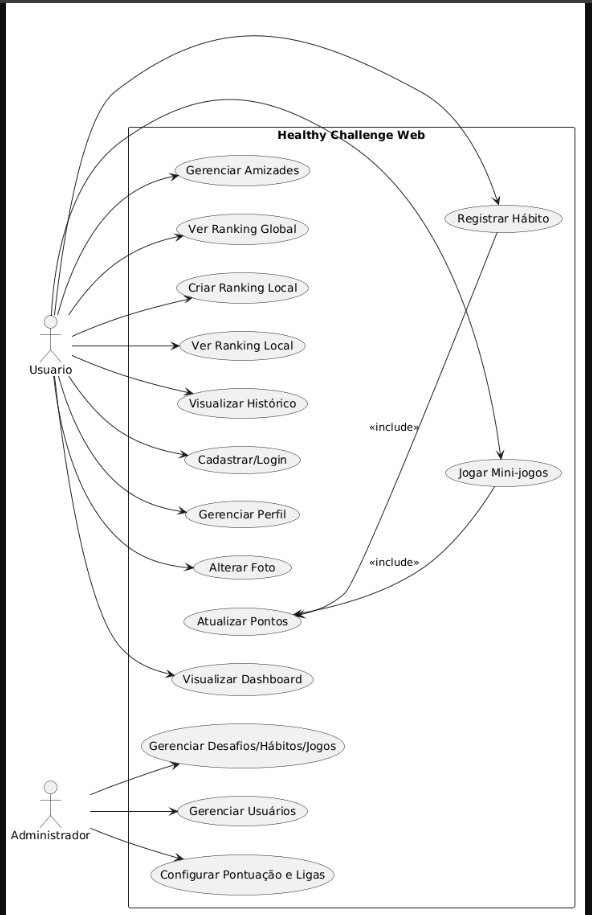

# Documento de Requisitos
## Projeto: Healthy Challenge Web

---

# 1. Introdução

## 1.1 Objetivo
O objetivo deste documento é descrever os requisitos funcionais e não funcionais da plataforma **Healthy Challenge Web**, um sistema web voltado para desafios saudáveis, gamificação, interação social e acompanhamento de progresso dos usuários.

## 1.2 Escopo
A plataforma permitirá que usuários realizem hábitos saudáveis, participem de mini-jogos cognitivos, acumulem pontos, acompanhem rankings e interajam socialmente com amigos. Administradores terão acesso ao gerenciamento completo da plataforma.

---

# 2. Visão Geral do Sistema

O sistema será uma aplicação web baseada em arquitetura cliente-servidor, permitindo:

- Cadastro e autenticação de usuários;
- Gestão de perfil;
- Sistema de amizades;
- Registro de hábitos e desafios;
- Mini-jogos cognitivos;
- Sistema de pontuação e ligas;
- Rankings globais e locais;
- Dashboard de progresso;
- Histórico de atividades;
- Painel administrativo.

---

# 3. Diagrama de Atores

> Inserir aqui a imagem do diagrama de atores do sistema.

---

# 4. Requisitos Funcionais

## 4.1 Gestão de Conta e Perfil

| ID | Requisito | Prioridade |
|---|---|---|
| US01 | Eu como usuário gostaria de cadastrar e logar a minha conta na plataforma. | Alta |
| US02 | Eu como usuário gostaria de alterar os meus dados dentro da plataforma. | Alta |
| US03 | Eu como usuário gostaria de alterar a minha foto de perfil dentro da plataforma. | Média |

---

## 4.2 Interação Social e Conexões

| ID | Requisito | Prioridade |
|---|---|---|
| US04 | Eu como usuário gostaria de enviar, aceitar ou cancelar solicitações de amizade. | Alta |

---

## 4.3 Atividades e Desafios

| ID | Requisito | Prioridade |
|---|---|---|
| US05 | Eu como usuário gostaria de registrar na plataforma que concluí um hábito saudável. | Alta |
| US06 | Eu como usuário gostaria de acessar e jogar os mini-jogos cognitivos da plataforma para concluir desafios extras. | Média |

---

## 4.4 Sistema de Pontuação e Recompensas

| ID | Requisito | Prioridade |
|---|---|---|
| US07 | Eu como usuário gostaria que a plataforma atualizasse os pontos no meu perfil após a conclusão de uma tarefa ou desafio. | Alta |

---

## 4.5 Rankings e Competitividade

| ID | Requisito | Prioridade |
|---|---|---|
| US08 | Eu como usuário gostaria de ver a minha liga e posição no ranking global. | Alta |
| US09 | Eu como usuário gostaria de criar um ranking local com os meus amigos. | Média |
| US10 | Eu como usuário gostaria de ver a minha posição no ranking local em que estou adicionado. | Média |

---

## 4.6 Painel de Controle

| ID | Requisito | Prioridade |
|---|---|---|
| US11 | Eu como usuário gostaria de visualizar um dashboard contendo o resumo do meu progresso, minha liga atual, meus pontos totais e os atalhos para os desafios do dia. | Alta |

---

## 4.7 Histórico

| ID | Requisito | Prioridade |
|---|---|---|
| US12 | Eu como usuário gostaria de visualizar o histórico de atividades e pontuações. | Média |

---

## 4.8 Administração do Sistema

| ID | Requisito | Prioridade |
|---|---|---|
| US13 | Eu como administrador gostaria de criar, editar, visualizar e excluir desafios, hábitos e mini-jogos da plataforma. | Alta |
| US14 | Eu como administrador gostaria de visualizar e gerenciar as contas dos usuários cadastrados. | Alta |
| US15 | Eu como administrador gostaria de configurar as regras de pontuação e os critérios de progressão das ligas. | Alta |

---

# 5. Requisitos Não Funcionais

| ID | Requisito |
|---|---|
| RNF01 | A plataforma deve ter compatibilidade com browsers Firefox e Chrome. |
| RNF02 | O sistema deve utilizar o banco de dados relacional PostgreSQL como repositório principal de dados. |
| RNF03 | A arquitetura do código deve ser modular. |
| RNF04 | As credenciais do usuário devem ser obrigatoriamente protegidas com técnicas de hash no banco de dados e possíveis outras técnicas de criptografia para dados sensíveis. |
| RNF05 | O sistema deve ser desenvolvido utilizando uma arquitetura cliente-servidor web. |
| RNF06 | A interface deve ser dinâmica e as ações do usuário devem ser processadas e refletidas na tela em um tempo máximo de 3 segundos. |

---

# 6. Regras de Negócio

## RN01 — Sistema de Pontuação
O usuário deve receber pontos automaticamente após concluir hábitos, desafios ou mini-jogos.

## RN02 — Progressão de Liga
A progressão de ligas deve ocorrer conforme critérios configurados pelo administrador.

## RN03 — Rankings Locais
Os rankings locais devem considerar apenas usuários pertencentes ao grupo de amigos criado.

## RN04 — Segurança
As senhas nunca devem ser armazenadas em texto puro no banco de dados.

---

# 7. Tecnologias Sugeridas

| Camada | Tecnologia |
|---|---|
| Frontend | React.js |
| Backend | Node.js / Express |
| Banco de Dados | PostgreSQL |
| Autenticação | JWT |
| Hospedagem | Docker + Cloud |

---

# 8. Considerações Finais

Este documento apresenta os requisitos iniciais do sistema Healthy Challenge Web e poderá ser atualizado conforme evolução do projeto e surgimento de novas necessidades.